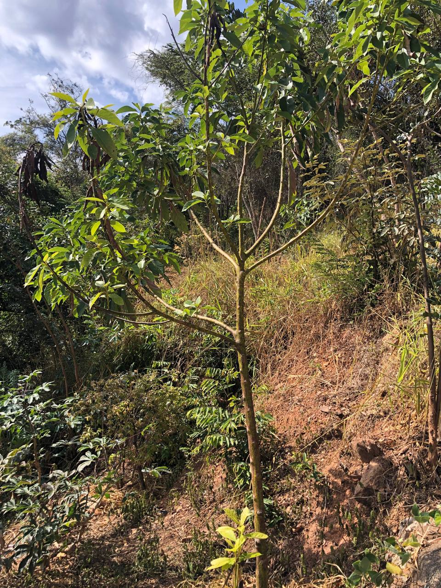

---
id:
  prefix: POM
  number: 2
title: Abacate 1
created_time: 2023-07-16T23:37:00.000Z
last_edited_time: 2023-12-24T15:07:00.000Z
ltima_edi_o_por:
  object: user
  id: 83f7a458-1779-4034-8d7d-b64a5b7fe724
tags:
  - lauracea
base_flor_stica: []
lon: -43.83181834012888
status: PUBLISHED
lat: -19.86986553735843
nome: Abacate 1
_thumbnail: ./Untitled_scwXRG2H.png

---

## Abacate precursor

Esse abacate já estava presente no local muito antes de iniciarmos o pomar em 2022.

Segundo o Sr Tião em uma supressão de leucenas na área, a pessoa responsável não sabia que ele era um lindo pé de abacate, e o orelha cortou ele bem lá no toco. Foi motivo para ficar chateado, porém nossa amiga seguiu firme e já tem mais de 2 metros 2023-12-23.

## ⚠️ Atenção

*   Esse indivíduo regularmente tem a presença de ervas de passarinho
