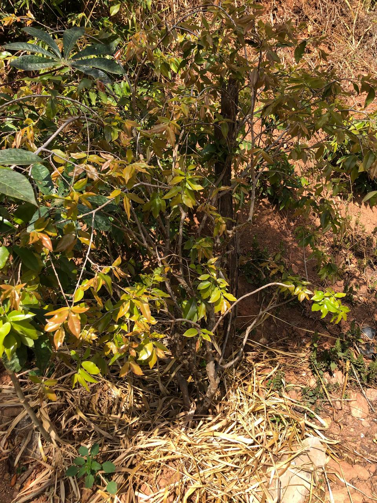

---
id:
  prefix: POM
  number: 4
title: Jabutica Olho de Boi
created_time: 2023-12-23T21:49:00.000Z
last_edited_time: 2023-12-24T01:28:00.000Z
ltima_edi_o_por:
  object: user
  id: 83f7a458-1779-4034-8d7d-b64a5b7fe724
tags:
  - mirtácea
base_flor_stica: []
lon: -43.83179285914299
status: PUBLISHED
lat: -19.869873735577674
nome: Jabutica Olho de Boi
_thumbnail: ./Untitled_tC9JOQc1.png

---

## Jabuticaba olho de boi

Essa linda garota foi doada pela Magda Montealto e mais duas pessoas, ela ficou na casa do Douglas Eleutério alguns meses antes de ir para o chão no pomar.

Ela desde a compra ficou estava com um galho quebrado ou era uma estaquia, não sei dizer, mas hoje nem dá para notar que isso existia.

Ela foi comprada nesse local <https://maps.app.goo.gl/RkZSiLiRMZXVZMn56>.

Ela já frutificou pelo menos 1x em 2023.

## ⚠️ Atenção

*   Ela tem uma vizinha muito próxima macaxeira, e está bem grande e pode estar prejudicando seu desenvolvimento, mas em breve vamos retirar a macaxeira e comê-la provavelmente na sopa.
